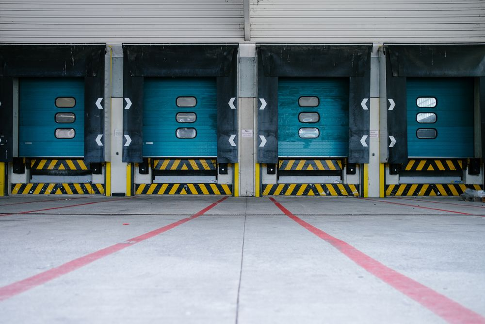

# Einleitung
„Globalisierung ist für unsere Volkswirtschaften das,
was für die Physik die Schwerkraft ist.
Man kann nicht für oder gegen das Gesetz der Schwerkraft sein – man muss damit leben.“
Alain Minc, französischer Ökonom (Zeit.de, 1998)

In dem Zitat von Minc wird deutlich, dass die Globalisierung allgegenwärtig ist. Unternehmen werden globaler und internationaler, so dass die verschiedenen unternehmerischen Aktivitäten zunehmen dezentraler organisiert werden. Zeitgleich spielt die zunehmende Digitalisierung der einzelnen Prozesse eine bedeutende Rolle.
In diesem Paper wird die Logistik als Bestandteil im Unternehmen beleuchtet. Um ein Grundverständnis für die logistische Funktion im Unternehmen zu bekommen, wird zunächst auf die Aufgaben, Ziele und Aspekte der Logistikfunktion eingegangen. Welcher Beitrag die logistische Funktion im Unternehmen hat, wird im darauffolgenden Kapitel geklärt. In Anlehnung an die vorher erwähnte zunehmende Bedeutung der Digitalisierung in der Wirtschaft, wird im letzten Kapitel auf die Fragestellung, welchen Einfluss die Digitalisierung auf die Logistik hat, eingegangen.

# Die Logistikfunktion im Unternehmen
## Aspekte, Aufgaben und Ziele
In Zeiten der Globalisierung und Internationalisierung ist es zur Normalität geworden, dass die Waren, Güter, Teile und Einsatzstoffe nicht an dem jeweiligen Ort zu dem jeweiligen Zeitpunkt erzeugt werden, in dem sie benötigt werden. Zentrale Aufgabe der operativen Logistik ist es daher, die geforderte Menge derjenigen Objekte in richtiger Zusammensetzung zum richtigen Zeitpunkt bereitzustellen. Stets sind dabei die Anforderungen der Auftraggeber, Verbraucher und Leistungsempfänger zu beachten. Um einen optimalen Abwicklungsprozess zu bieten, wird von der analytisch-planenden Logistik Prozesse, Strukturen und Systeme entwickelt sowie organisiert (Gudehus, 2015, S. 7).
Bei den zu befördernden Objekten entlang der Logistikkette handelt es sich dabei um „Handelswaren, Lebensmitteln, Rohstoffe oder Materialien, Vorprodukte, Halbfertigfabrikate und Fertigwaren, Investitionsgüter oder Konsumgüter ebenso wie Produktions- und Betriebsmittel“ (Gudehus, 2015, S. 7)
Am Anfang der Kette stehen die Quellen, Lieferanten oder Auslieferstellen, wie bspw. Produktionsanlagen, Vorratslager, Logistikzentren dieser Objekte, während Senken oder Anlieferstellen, dies können bspw. Geschäfte, Märkte und Filialen des stationären Handels sein, am Ende dieser stehen. Jede logistische Aktivität bzw. Aufgabe innerhalb dieser Prozesskette hat bestimmte Zielvorgaben. Dieses Ziel bezieht sich auf einen Aufgabenbereich, welcher definiert ist durch den Standort und Funktionen der Quellen, Senken und Materialvorgaben (Gudehus, 2015, S. 7 – 10).
Innerhalb eines Unternehmens beinhaltet der Logistik-Begriff die inner- und außerbetriebliche Logistik. Die innerbetriebliche Logistik umfasst an einem Standort den Wareneingang und -ausgang der internen Senken und Quellen der Logistikobjekte. Während sich die außerbetriebliche Logistik in die Ausrichtungen Beschaffungs- und Distributions- und Entsorgungslogistik unterteilt. Insgesamt haben beide Funktionen die Aufgabe den Warenausgang sowie die Wareneingänge verschiedener Logistikstandorte zu regeln. Darüber hinaus verfolgen sie die übergeordneten Ziele der Leistungserfüllung, Qualitätssicherung und Kostensenkung, wobei die Priorisierung, Inhalten und Gewichtung abhängig von der jeweiligen Aufgabenstellung ist (Gudehus, 2015,    S. 12).Aufgabe der Beschaffungslogistik ist es die Güter dem Unternehmen zur Verfügung zu stellen, welche es für den Unternehmenszweck benötigt.
Dabei reicht der Aufgabenbereich von dem Kontakt zum Lieferanten bis hin zur Bereitstellung der Güter für die Produktion oder für den Verkauf im Handel. Anders als bei der Beschaffungslogistik ist zentraler Gegenstand der Distributionslogistik die bereits verkaufsfertigen Waren. Die Zuführung der Ware zum Absatznehmer erfolgt über ein Netz von Transportkanälen, Lager- und Umschlagpunkten. Dadurch ist sie Schnittstelle zwischen Produktion und Absatzmarkt und stellt die Verbindung zum Kunden dar. Der Warenfluss hin zum Kunden ist durch die Beschaffungs- sowie Distributionslogistik geregelt. Jedoch ist sich die Frage zu stellen, wie mit rückläufiger Ware umgegangen wird? Dies ist Aufgabe der sogenannten Entsorgungslogistik. Sie umfasst dabei die logistische Spanne vom Absatzmarkt zurück zum Beschaffungs- und Entsorgungsmarkt. Dabei kann die jeweilige Ware an verschiedenen Stellen der Lieferkette wieder eingeordnet werden (Muchna et al., 2018, S. 27 – 30).

## Beitrag der Logistik in Bezug auf die Unternehmensstrategie
Als Bestandteil eines Unternehmens hat die Logistik verschiedene Funktionen und Ziele. Diese wurden in Kapitel 2.1 dargestellt. Darüber hinaus hat die Logistikfunktion im Unternehmen wesentlichen Einfluss auf die Unternehmensstrategie und damit verbunden auf den Erfolg eines Unternehmens. In diesem Kapitel wird daher der Beitrag der Logistik zur Unternehmensstrategie betrachtet.
Aus der Mission des jeweiligen Unternehmens lassen sich strategische Ziele formulieren, wodurch der konkrete Beitrag der jeweiligen Funktion, in diesem Falle der Logistik, zur Erreichung der Mission bestimmt werden kann. Um das vorgegebene Ziel zu erreichen sind ein oder mehrere Strategien für den Bereich der Logistik im Unternehmen zu formulieren. Aus diesen werden operative Maßnahmen für den Bereich abgeleitet. Diesen bedarf es einer stätigen Optimierung und Weiterentwicklung, da die Maßnahmen die täglichen logistischen Aktivitäten eines Unternehmens betreffen (Muchna et al., 2018, S. 52 – 53).
Im Gegensatz zu den operativen Maßnahmen sind die Logistikstrategie langfristig orientiert. Welche Bedeutung diese für ein Unternehmen haben, hängt von dem Beitrag der Logistik für die Erreichung der strategischen Unternehmensziele ab. Um dies beurteilen zu können, ist zu klären, inwiefern die Logistikfunktion im Unternehmen zur Positionierung gegenüber dem Wettbewerb im Markt sowie zur Kundenzufriedenheit beiträgt (Muchna et al., 2018, S. 55).

## Veränderung der Logistikfunktion
Der Stellenwert der Logistik hat sich durch das Umdenken der Menschen in den letzen Jahren deutlich geändert. Logistische Aktivitäten konzentrieren sich nun nicht mehr allein auf das eigene Unternehmen, sondern gehen über dies hinaus. Lieferanten und Kunden werden in den Wertschöpfungsprozess integriert, so dass dieser möglichst effizient gestaltet wird. Diese strukturellen Veränderungen führen dazu, dass sich die Unternehmen mehr auf die eigene Kernkompetenz in der Wertschöpfung konzentrieren. Somit rückte die Fragestellung, ob es strategisch sinnvoll ist Outsourcing zu betreiben und die Verantwortung einem spezialisierten Logistikdienstleister zu übertragen, ins Zentrum der Managemententscheidungen. Durch den Einfluss der Globalisierung und Digitalisierung wird der Blickwinkel auf die Logistik stetig verändert und der Aufgabenbereich immer komplexer. Mit zunehmenden Komplexitätsgrad nimmt die Verzahnung der Wertschöpfungskette und der einzelnen Unternehmensfunktionen zu, wodurch der Einfluss der Logistik zur Erreichung der Unternehmensziele zeitgleich zunimmt (Göbl, Froschmayer, 2019, S. 42).
Im Zuge der Digitalisierung wurde der Begriff der „Logistik 4.0“ immer prägnanter. Die Möglichkeiten Datenmengen zu speichern, übertragen und zu bearbeiten, führen dazu, dass die logistischen Aktivitäten eines Unternehmens automatisiert werden. Darüber hinaus stehen den Akteuren der Logistikbranche digitale Informationen zu Verfügung. Diese geben Auskunft über Eigenschaften der Objekte sowie den aktuellen Ort, welche sowohl in die externe Umwelt des Unternehmens kommuniziert, als auch von dieser gelesen werden können, so dass eine wechselseitige Beziehung zwischen diesen Ebenen entsteht (Bousonville, 2017,S.4–5).
Resultierend aus dieser Verzahnung der einzelnen Ebenen miteinander, ergibt sich die Fragestellung wie sich die Anforderungen an den Menschen im Rahmen des Wertschöpfungsprozesses ändern? Der Wareneingang/ -ausgang, Lagerung, Kommissionierung und Verpackung der Ware sind Bestandteile des Wertschöpfungsprozesses der Logistik.
Durch autonome Transportsysteme verändern sich die Be- und Entladungsprozesse im Rahmen des Warenein- und ausgangs. So müssen Beschäftigte nicht mehr selbst die Ware entladen oder verladen. Durch die Automatisierung der Wareneingangsprüfung, fallen Prozesse der Angestellten weg, welche zuvor manuell geprüft haben, ob die eingegangene Ware mit den
4
Lieferpapieren übereinstimmt. In der Praxis kann dazu bspw. ein „3D- Konturencheck“ angewendet werden, welcher mit Sensoren die Ware erfasst. Erfassen diese eine Abweichung vom vorgegebenen Packmuster, werden Mitarbeiter benachrichtig. Diese können die Ware dann selbst überprüfen und ggf. Qualitätssicherungs- bzw. Reklamationsprozesse einleiten. Durch den Einsatz von intelligenten Objekten, automatisierter Identifikationssysteme, wird eine automatisierte Warenerfassung und -verfolgung den Kunden ermöglicht (Straub et al., 2017, S. 48).
Ein weiterer Teil des Wertschöpfungsprozesses ist die Lagerung der Ware. Zumeist wird die Verteilung auf die verschiedenen Lagerbereiche und die Einlagerung von Mitarbeitern übernommen. Diese werden in ihrer Aufgabe von Fördertechniken bzw. Regalbediengeräten unterstützt. Heutzutage wird die Vergabe der einzelnen Lagerplätze im Großraumlager bereits über ein computergestütztes Materialflusssystem vorgenommen. In der Zukunft können hier für autonome Transportsysteme genutzt werden. In der darauffolgenden Abbildung 1 ist ein solches Transportsystem zu sehen. Dieses kann autonom wie auch manuell von einem Mitarbeiter bedient werden. Durch die Vernetzung der Transportsysteme untereinander, können sich die Systeme selbst organisieren, so dass einem reibungslosen und optimalen Transport nichts im Wege steht (Straub et al., 2017, S. 48). Insbesondere wirkt sich die Digitalisierung bei der Kommissionierung aus. Hier wird das Prinzip „Person zu Ware“ durch autonome Systeme umgekehrt (Ware zu Person). Dadurch werden Suchzeiten und Fahrwege der Mitarbeiter reduziert und Fehler vermieden. Die zusammengeführten Artikel durch die Kommissionierung sind im Rahme des Wertschöpfungsprozesses der Logistik zu verpacken. Je nach Versandvolumen geschieht dies durch Maschinen oder manuell durch Mitarbeiter. Insbesondere das um- bzw. zusammenpacken von Kartons auf Paletten geschieht manuell. Im Hinblick auf die demografische Entwicklung spielt der Aspekt der Belastungsgrenzen der Beschäftigte einen eine große Rolle. Durch sogenannte „Palettierroboter“ und computergestütze Programme kann das manuelle Palettieren diesen abgenommen werden. Um den Wertschöpfungsprozess zu schließen wird das Packmuster per Mikrochips gespeichert, so dass dieses bei Wareneingang beim Kunden überprüft werden kann (Straub et al., 2017, S. 49).

# Fazit
Das vorliegende Paper soll verdeutlichen, welchen Einfluss die Digitalisierung auf die Logistikfunktion hat, da diese Funktion wesentlicher Bestandteil eines Unternehmens ist.
Durch die Darstellung des Einflusses der Logistik in Bezug auf die Unternehmensstrategie, welche zur Erreichung des unternehmerischen Erfolges essenziell ist sowie durch die Beschreibung der zunehmenden Digitalisierung der Logistik, wird deutlich, dass der Komplexitätsgrad des Aufgabenbereiches und die Verzahnung der einzelnen Unternehmensfunktionen zunimmt.
Jedoch ist die Digitalisierung ein unumgänglicher Schritt, welcher von Unternehmensseite aus geleistet werden muss, um die Globalisierung des Unternehmens voranzutreiben und somit wettbewerbsfähig zu bleiben.

